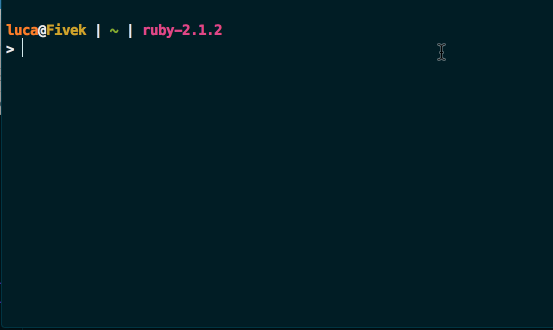
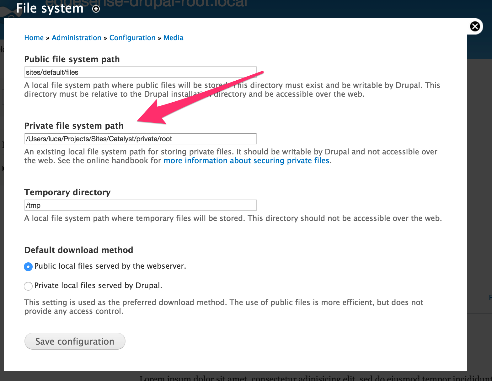
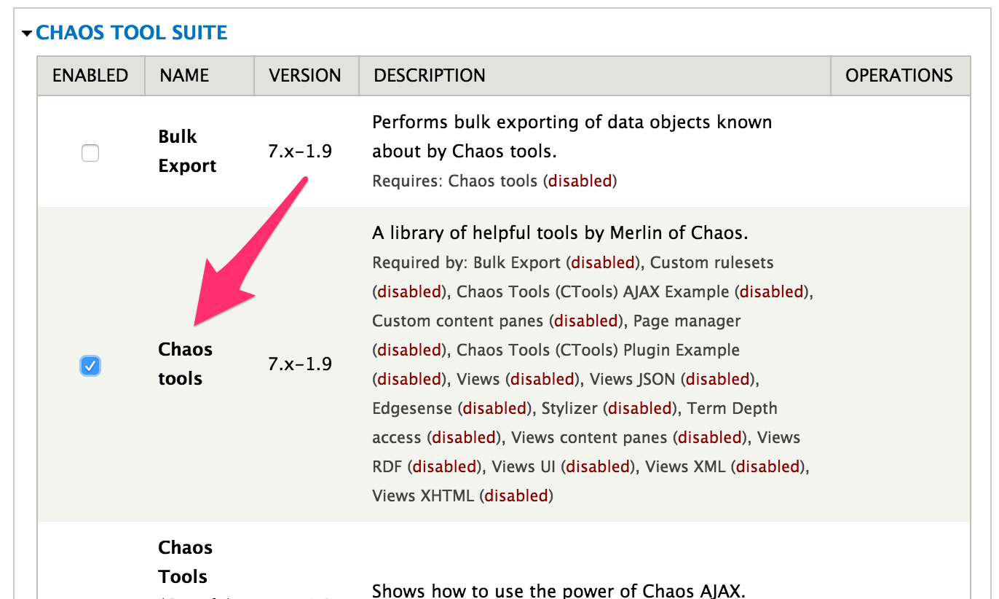
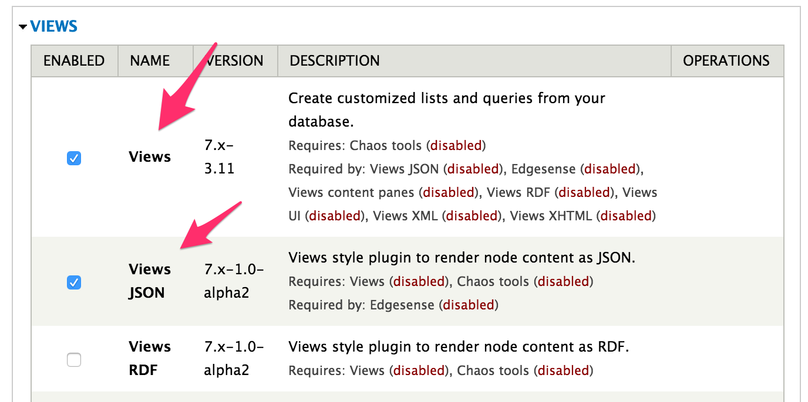
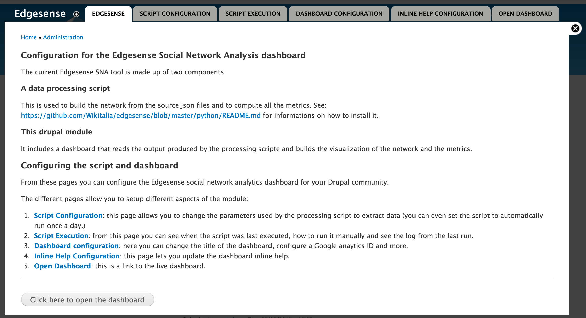

# Install 

The Edgesense Drupal module requires other components to be installed on the server to function. The module itself checks for all the prerequisites and notifies you if anything is missing, but it is better to simply install them before configuring the module.

### Detailed procedure
1. [Install the data processing library](#1-install-the-data-processing-library)
2. [Enable the private files](#2-enable-the-private-files)
3. [Install the required drupal modules](#3-install-the-required-drupal-modules)
4. [Install the module](#4-install-the-module)

If you have an old stand-alone installation of edgesense working with your site, you'll need to do some cleanup beforehand. See [old edgesense installation cleanup](#b-old-edgesense-installation-cleanup) for details.

## 1. Install the data processing library

First you need to install the python library, [the instructions](../../python/README.md) are simple, on the computer where the drupal application is running (that is your site web server), you will need to:

- connect to the machine with `ssh` or other method
- execute `sudo pip install edgesense` on the console
- make sure the `edgesense_drupal` is available to the user running the drupal application (the directory where `edgesense_drupal` has been installed by the `pip install` command should be in the default PATH)



If you are not able to do it on your own you need to **ask for help to your server administrator**. This may happen for instance if you don't have enough permissions to install new software on that server.

## 2. Enable the private files 

The private files directory is required to be setup in drupal since that is the place on the server where the module stores the configuration for the script that runs (the module requires it to be in the private files directory to make sure it's not accessible from the browser.)

To enable the private files directory you will need to:

- go in the drupal administration page, 
- open the **Configuration** > **File system** panel
- add a directory in the **Private file system** field
- save the configuration



The configured directory should:

- exist on the server filesystem
- be writable by the user running the drupal application


## 3. Install the required drupal modules

These modules are required and need to be installed:

- Chaos Tool Suite (CTools): 
    - download the module from https://www.drupal.org/project/ctools, 
    - uncompress it in `<drupal root>/sites/all/modules/contrib/ctools`       
- Views:
    - download the module from https://www.drupal.org/project/views,
    - uncompress it in `<drupal root>/sites/all/modules/contrib/views`
- Views Datasource:
    - download the module from https://www.drupal.org/project/views_datasource, 
    - uncompress it in `<drupal root>/sites/all/modules/contrib/views_datasource`
        
From the admin interface in Drupal, enable the following modules (at least): 

- Chaos tools, 
- Views, 
- Views JSON




And save the configuration.

## 4. Install the module

- Download the module: [edgesense_latest.tgz](../dist/edgesense_latest.tgz)
- Unpack the module in `<drupal root>/sites/all/modules/contrib/edgesense`
- From the admin interface in Drupal, enable the Edgesense module


If the module has been activated correctly you will be shown this message:


During the install phase the module will **not** run the data processing script because **this can take a long time** for large communities and this would cause a timeout error during the install process. At the end of the module activation you'll be able to open the module admin page which will have a button to immediately run the data processing script. If your community is small then you can do it by clicking the "Run Now" button on the page.


If you click that button and the script has run you'll see this message:


If you community site is big (e.g. more then 100 users, 300 nodes or 500 comments) you will need to run it using cron / drush to avoid timeouts. [See below for more detailed instructions on how to do so](https://github.com/Wikitalia/edgesense/tree/master/php/drupal#b-avoiding-timeouts).

## Appendix

### A. Post install customizations

You can customize your Edgesense install in various ways:

- If you need to change the parameters by which the script processes the data, you can do so using the Edgesense configuration panel accessible from the Drupal admin interface: .
- If you need any special behaviour when selecting the data from the site you can customize the `edgesense_*` views, for instance if you want to filter somehow the data. If you have customized your views then updating the module in the future will not rebuild the views, but it'll keep your customizations.

### B. Avoiding timeouts

If you have a big community the default Drupal's cron system setup may time out. The easiest way to avoid timeouts is to make sure that Drupal's cron is running for your site via [drush](http://www.drush.org/). 

If you go this route, the minimum requirement is **Drupal 7.40** due to the fix that came in for [drupal_set_time_limit()](https://api.drupal.org/api/drupal/includes%21common.inc/function/drupal_set_time_limit/7): Drupal prior to 7.40 was setting a hard timeout at 240 second timeouts in various locations internally, including for its Drupal cron job. So even though PHP run via cron with no timeout, Drupal was erroneously limiting itself to 240 second.

To use use Drupal's cron directly you'll need first to install drush. Then you'll have to edit the system wide crontab (usually /etc/crontab) and set it to run drupal's cron as the user your web server is running under.

For example:

`0 * * * * www-data /usr/bin/env drush --root=/path/to/your/drupalroot --quiet cron`

The above example is for Ubuntu but it should be fairly straightforward to adjust for other distros. See the [Drush documentation](http://www.drush.org/en/master/cron/) for details.

The module runs the script once a day and sets a variable in drupal to trigger the next execution. If you need to force execution of the script you'll need to set thi variable before running cron. It's done easily with drush:

```
drush --root=/path/to/your/drupalroot variable-set edgesense_next_execution $(date +%s)
drush --root=/path/to/your/drupalroot cron
```

See the drush command documentation for [variable-set](http://drushcommands.com/drush-7x/variable/variable-set) and [variable-get](http://drushcommands.com/drush-7x/variable/variable-get) for details.

Otherwise you'll have to disable the automatic daily run from the Edgesense admin pages and you will have to schedule the runs with a different method (e.g. using the server system's cron scheduler).


### C. Old edgesense installation cleanup

You will need to do some cleanup prior to the install if you had configured your drupal site for a standalone version of Edgesense. This is because the new module will create the views for you and it will not overwrite a view if it find one with the same name. If the old views were not configured correctly for the new module then the export of the data might fail when running the data processing step. Therefore it is advisable to remove o at least rename the views.

### D. Errors while installing

You may receive some error message when installing the module if some of the prerequisites are not met. In this case you will need to:

1. disable the Edgesense module (if it was enabled)
2. uninstall the Edgesense module (from the Drupal modules admin page)
3. fix the error (e.g. install the missing library)
4. enable again the Edgesense module 